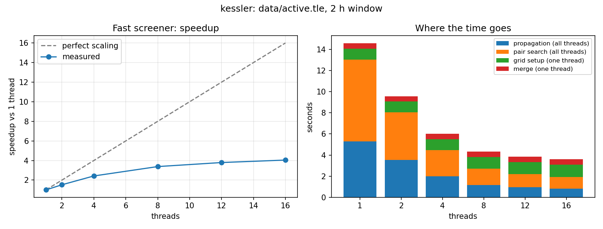

# kessler

**A high-performance satellite conjunction screening engine in C++20.**

kessler predicts close approaches between every active satellite in Earth orbit,
and proves the optimized versions answers match a brute force reference exactly.

<!-- Phase 7: replace with a GIF of the Cesium globe visualization -->


## Results

All runs: CelesTrak active sat catalog (15,956 objects),
10s time steps, 5km miss distance, Intel Core Ultra 9 285H (16 cores)

| Run | Brute force (1 thread) | kessler (16 threads) | Speedup | Same answer? |
|---|---|---|---|---|
| Full catalog, 1 h window | 70.6 s | 1.8 s | **39.6x** | Yes, all 1,967,502 hits identical |
| 3,000 objects, 6 h window | 17.7 s | 3.3 s | 5.4x | Yes, all 403,315 hits identical |

**Full catalog over 24 hours:** about 66 s end to end (screening 43.7 s, grouping 9.9 s,
refinement 12.1 s), finding 96,018 passes within 5 km. Brute-force screening alone is
projected at about 28 minutes.



**where the time goes** Propagation and pair search scale well. 
Grid setup and mergin cap overall speedup at 4x on 16 cores. 
Parallelizing the per-step sort is the next optimization probably.

**result interpretation** Public TLEs are accurate to about a km,
so miss distances are predictions, not measurements. Objects flying
together are reported with near zero miss and near zero relative speed.
kessler currently only finds close approaches, not collision probability. 
yet...

## "problem"

There are over 15,000 tracked objects, which means hundreds of millions of
pairs to check at every time step, and objects close on each other at up to
~20 km/s. A brute-force search takes hours; a naive "fast" search misses 
collisions that happen between time steps. kessler is fast **and**
provably agrees with a brute-force reference. See [docs/ARCHITECTURE.md](docs/ARCHITECTURE.md).

## Quick start

```bash
cmake -S . -B build -DCMAKE_BUILD_TYPE=Release
cmake --build build -j
ctest --test-dir build --output-on-failure
./build/kessler data/catalog.tle
```

See [data/README.md](data/README.md) for downloading orbit data.

## How correctness is verified

1. SGP4 propagation matches the official Vallado test vectors.
2. Every optimized screener must produce **identical** results to a brute-force
   oracle on a reference subset.
3. The full pipeline was run against the brute-force reference on the complete active
   catalog: identical hits, and identical conjunctions with and without the run skipping.

Details: [docs/VALIDATION.md](docs/VALIDATION.md).

## Roadmap

- [x] TLE parsing + SGP4 propagation (matches Vallado's reference to under a micrometer)
- [x] Brute-force screening (the reference answer)
- [x] Time-of-closest-approach refinement
- [x] Spatial grid + OpenMP, verified identical to brute force
- [x] Benchmarks and thread scaling
- [ ] Parallel per-step sort (remove the single-threaded bottleneck)
- [ ] Interpolate between SGP4 samples to cut propagation cost
- [ ] Validation against CelesTrak SOCRATES
- [ ] Collision probability using orbit uncertainty
- [ ] 3D visualization

## Acknowledgments

- SGP4 reference implementation: Vallado, D. A., Crawford, P., Hujsak, R., and
  Kelso, T. S., "Revisiting Spacetrack Report #3," AIAA 2006-6753.
  https://celestrak.org/publications/AIAA/2006-6753/
- Orbital data and SOCRATES reports: [CelesTrak](https://celestrak.org).
