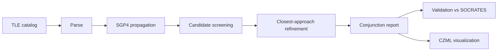

# Architecture

<!-- Grow this document phase by phase. Keep a diagram at the top (Mermaid
     renders natively on GitHub). -->

## Coordinate frame

SGP4 outputs position and velocity in the TEME frame. Every object is in the
same frame, and the distance between two points does not change when the frame
rotates, so conjunction screening needs no frame conversion. Conversion to
Earth-fixed coordinates is only needed for visualization.

## Time

Each TLE has its own epoch. To compare objects, every object is propagated to
the same absolute UTC instants: `minutes_since_epoch_i = (t - epoch_i)`.

## Components

_TBD as phases are completed._
